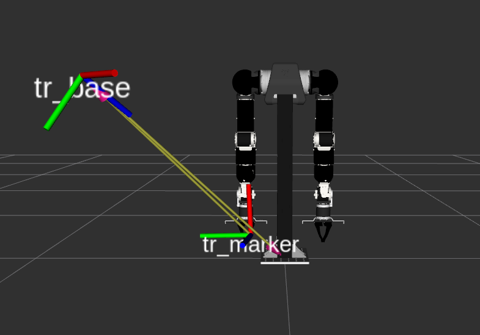

# OpenArm Calibration

Hand-to-eye (eye-on-base) calibration package for OpenArm using the easy_handeye2 library .



## Hardware
* Robot: Openarm 1.0
* Camera: HIKROBOT MV-CH100-60UC + MVL-KF0618M-12MPE
* Tag: 50x50 mm Aruco Tag

## Prerequisites

THis project rely on the ROS2 package for openarm and easy_handeye2. Thus, ensuring that you have those packages:

```bash
# CLone the openarm ros2 packages
mkdir -p openarm/ros2_ws/src
cd ~/openarm/ros2_ws/src
git clone https://github.com/enactic/openarm_ros2.git

# Clone easy_handeye2
cd ./openarm_ros2
git clone https://github.com/marcoesposito1988/easy_handeye2.git

# Clone the project
git clone https://github.com/CROBOT974/openarm_calibration.git

# Build
cd ~/openarm/ros2_ws
source /opt/ros/humble/setup.bash
colcon build --symlink-install
```

We supposed that you completed the "setup" process(https://docs.openarm.dev/1.0/software/setup/) of the openarm_ros2 package before you start this project.

## Per-terminal Setup

Source these in every new terminal before running any commands:

```bash
source /opt/ros/humble/setup.bash
source ~/openarm/ros2_ws/install/setup.bash
```

## 1. Camera Intrinsic Calibration

Set the intrinsic parameters of your camera is essential. You can develope your calibration algorithm or simply use the ./scripts/camera_calib.py. 

During the Calibration process, place a Opencv chessboard(https://docs.opencv.org/4.x/pattern.png) in front of the camera and show it from multiple angles.

```bash
cd ~/openarm/ros2_ws/src/openarm_ros2/openarm_calibration/scripts
python3 camera_calib.py   # images saved under Camera/test2
```

- Press `c` to capture frames (collect 15-30 frames).
- Press `s` to compute and display calibration results.
- Copy the output `fx`, `fy`, `cx`, `cy` values into the `DEFAULT_CAMERA_MATRIX` constant in `aruco_pose_node.py`.

After obtaining the paramteres, remember to replace the DEFAULT_CAMERA_MATRIX in aruco_pose_node.py with your values.


## 2. Hand-Eye Calibration

### Terminal 1 — Launch the robot and easy_handeye2

```bash
ros2 launch openarm_calibration calibrate.launch.py
```

### Terminal 2 — Auto-sampling

Moves the arm through predefined poses. After each pose, click **Take Sample** in the rqt panel, then press Enter to continue.

```bash
ros2 run openarm_calibration auto_sample.py \
  ~/openarm/ros2_ws/src/openarm_ros2/openarm_calibration/scripts/calibration_poses.yaml
```

### Terminal 3 — ArUco marker detection

```bash
ros2 run openarm_calibration aruco_pose_node.py \
  --camera-frame tr_base \
  --marker-frame tr_marker
```

After collecting **15 samples**, click **Compute Calibration** in the rqt panel.

The result is saved to `~/.ros2/easy_handeye2/calibrations/openarm_right_eob.calib`.

## 3. Verify Calibration Result

### Terminal 1 — Simulated robot (with physical robot)

```bash
ros2 launch openarm_bringup openarm.bimanual.launch.py \
  arm_type:=v10 use_fake_hardware:=false
```

### Terminal 2 — ArUco marker detection

```bash
ros2 run openarm_calibration aruco_pose_node.py \
  --camera-frame tr_base \
  --marker-frame tr_marker
```

### Terminal 3 — Publish calibration TF

```bash
ros2 run openarm_calibration publish_calib.py \
  --name openarm_right_eob
```

### Terminal 4 — Move arm and verify marker alignment

```bash
ros2 action send_goal /right_joint_trajectory_controller/follow_joint_trajectory \
  control_msgs/action/FollowJointTrajectory \
  '{trajectory: {joint_names: ["openarm_right_joint1","openarm_right_joint2","openarm_right_joint3","openarm_right_joint4","openarm_right_joint5","openarm_right_joint6","openarm_right_joint7"], points: [{positions: [0.3, 0.0, 0.0, 0.5, 0.0, 0.0, 0.0], time_from_start: {sec: 3, nanosec: 0}}]}}'
```

Check that `tr_marker` is aligned with the robot end-effector in RViz.

## Nodes

| Node | Description |
|------|-------------|
| `aruco_pose_node.py` | Detects ArUco marker via Hikrobot USB3 camera, publishes `tr_base → tr_marker` TF |
| `auto_sample.py` | Moves the right arm through predefined poses for calibration sampling |
| `publish_calib.py` | Reads `.calib` result and publishes `world → tr_base` as a static TF |

## Result

https://github.com/user-attachments/assets/dbe23aab-5cfa-4bee-9f08-91562eb0b79a


## Citation

If you use this code in your research, please cite:

```bibtex
@software{Openarm_Calibration,
  author = {Chi, Cheng and LiKang, Song and Jiaxi Zheng},
  title = {Hand-to-eye calibration package for OpenArm using the easy_handeye2 library},
  url = {https://github.com/CROBOT974/openarm_calibration.git},
  version = {1.0.0},
  year = {2026}
}
